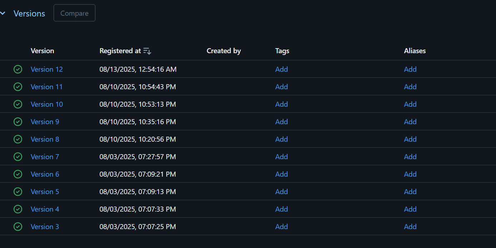

# Auto MPG Prediction Capstone Project

This project focuses on predicting the miles per gallon (MPG) of automobiles using various machine learning models. It covers the entire ML lifecycle — from data preparation and model training to deployment, tracking with MLflow, and production monitoring with drift detection.

---

## Project Overview

1. **Train & Pick the Best Model**

   - **Data Preparation:**  
     Cleaned the Auto MPG dataset by handling missing values and normalizing features for consistent training.

   - **Model Training:**  
     Experimented with 5 regression models:
     ```python
     models = {
       "LinearRegression": LinearRegression(),
       "Ridge": Ridge(alpha=1.0),
       "RandomForest": RandomForestRegressor(n_estimators=30, random_state=42),
       "SVR": SVR(),
       "KNN": KNeighborsRegressor(n_neighbors=5)
     }
     ```
   - Evaluated models using metrics: RMSE, MAE, R2_score, and MAPE.

2. **Deployment**

   - Created a REST API to serve predictions using Flask.
   - API code can be found at: `capstone_project/app.py`
   - The best performing model is saved as `bestAutoMPGModel.pkl`.
   - Also deployed at `.github/workflows/ci-cd.yml`

3. **MLflow Tracking**

   - Logged all model training metrics and parameters to MLflow.
   - Compared model performances visually in the MLflow UI.
   - Registered the best model in the MLflow Model Registry.

4. **Monitor in Production**

   - Continuously track real-world prediction accuracy.
   - Implemented drift detection on key features:
     
     | Feature       | Drift Type                   | Description                                                                                  |
     |---------------|------------------------------|----------------------------------------------------------------------------------------------|
     | `displacement`| ↑ Increased (synthetic drift)| Scaled up by ~15% to simulate newer models with larger engines in some regions               |
     | `horsepower`  | ↓ Decreased (synthetic drift)| Scaled down by ~15% reflecting shifts towards fuel efficiency or emission regulations        |
     | `model_year`  | → Naturally different        | Used as split condition: older (`<=75`) vs newer (`>75`)                                    |

   - Alerts trigger if new data significantly diverges from the training distribution.

---

## Final Deliverables

### 1. Model Comparisons

Visual comparison of model performance metrics (RMSE, MAE, R2, MAPE) logged and displayed in the MLflow UI.

  
*Comparison of regression models based on RMSE in MLflow.*

  
*Comparison of regression model performance across multiple metrics (MAE, R², MAPE, etc.) in MLflow.*

---

### 2. Version History and Rollback Demonstration

MLflow Model Registry showing version history of the registered models and the ability to rollback to previous stable versions.

  
*Version control and rollback capabilities in MLflow Model Registry.*

---

### 3. Model Deployment

Flask REST API running locally and serving predictions using the best model via capstone_project/app.py.
Also deployed using GitHub Actions at .github/workflows.

---

### 4. Monitoring Dashboards

Monitoring dashboard showing real-world prediction accuracy and drift detection alerts for fuel efficiency predictions over time.


[Open Monitoring Dashboard (HTML file)](capstone_project/data_drift_report.html)
*Dashboard Data Drift.*
[Open Monitoring Dashboard (HTML file)](capstone_project/model_performance_report.html)
*Dashboard Model Drift.*

---

---

